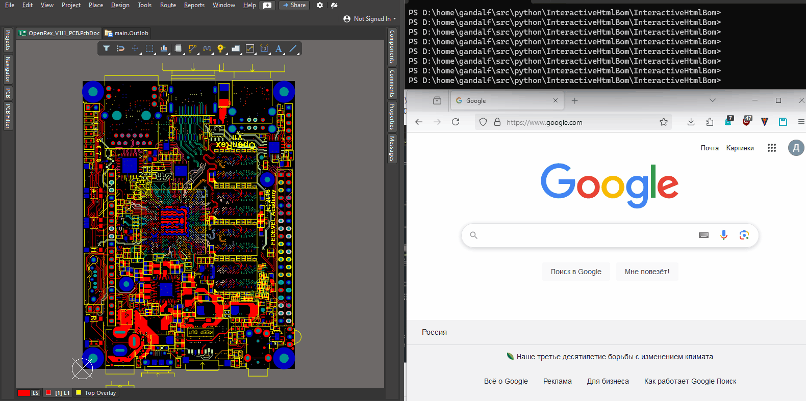
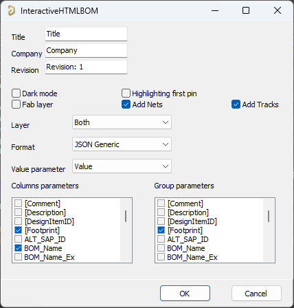

# Interactive HTML BOM plugin for Altium Designer
## Supports Altium Designer

This plugin inspired with [InteractiveHtmlBomForAD](https://github.com/lianlian33/InteractiveHtmlBomForAD), but (i hope) less of bugs and more of features.

Plugin is ready to use as OutJob Report Output. Based on plugin for KiCad [InteractiveHtmlBom](https://github.com/openscopeproject/InteractiveHtmlBom).

This plugin generates a convenient Bill of Materials (BOM) listing with the
ability to visually correlate and easily search for components and their placements
on the PCB. It is particularly useful when hand-soldering a prototype, as it allows
users to quickly find locations of components groups on the board. It is also possible
to reverse lookup the component group by clicking on a footprint on the board drawing.

The plugin utilizes Altium Designer pascal script and API to read Project/SCH/PCB data and render silkscreen,
footprint pads, text, and drawings.

There is an option to include tracks/zones data as well as netlist information allowing
dynamic highlight of nets on the board.

Generated html page is fully self contained, doesn't need internet connection to work
and can be packaged with documentation of your project or hosted anywhere on the web.

## How to Run
Plugin could be used in a few ways, as a OutJob or as a Script.

### Script
1. Download the entire set of files on your computer or clone repository the way your prefer.
2. Integrate the script into Altium Designer.\
If you are a newcomer to Altium scripts, [please read the "how to" help page](https://github.com/Altium-Designer-addons/scripts-libraries/blob/master/HowTo_execute_scripts.md).
3. Run script from pcb layout.
4. A GUI will open. Select options and run.

### OutJob
1. Download the entire set of files on your computer or clone repository the way your prefer.
2. Add InteractiveHTMLBOM4Altium2.pas to Project.
3. In Output Job File add new Report Output, select InteractiveHTMLBOM4Altium2.pas in Script Output.
4. Configure and generate content.

Note: May take a long time to run depending on board size, board density, & speed of computer. It took my PC 5 seconds to place 200 components and about 50 seconds to place 2000 components on a much more dense board. My PC is relatively fast, so your mileage may vary.
